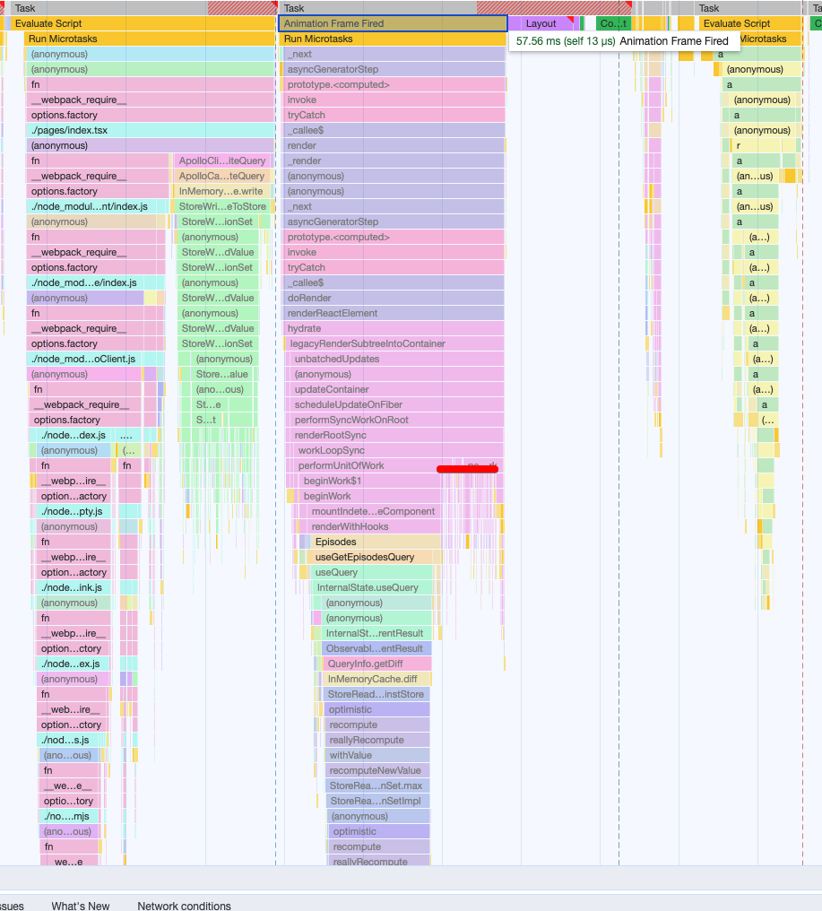
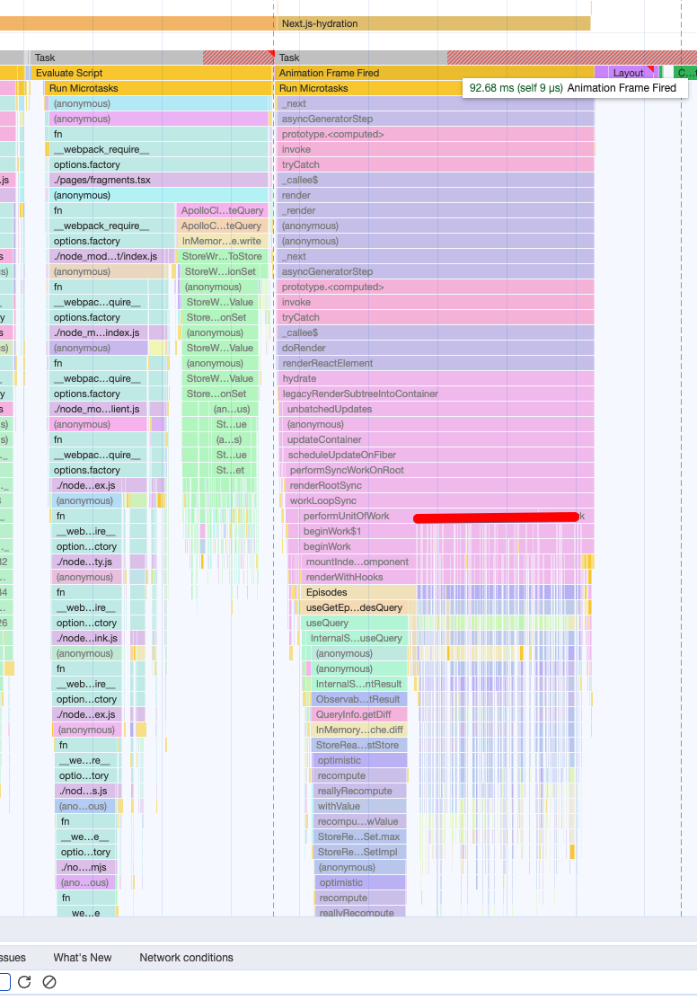

# README

This example repo is able to show the performance implications of using fragments across many components. Note that this is using React 17 and not React 18.

## How to use it

- run `npm ci && npm run dev`
- navigate to http://localhost:3000/ to load the data via a single root useQuery call or http://localhost:3000/fragments to load the subcomponents using useFragment calls

## Why are we doing this performance analysis?

We want to simplify our development experience by co-locating a component's data requirements via fragments. We have very strict site-speed requirements and therefore we don't want to cause degradations in Total Blocking Time and Time to Interactive. We did an experiment to test what our potential long term performance would be if many components started to use fragments and we saw that these changes dropped our Total Blocking Time quite significantly. Upgrading to React 18 will help with Total Blocking Time but the slowdown will still push down subsequent long times further back impacting our Time to Interactive timing, Largest Contentful Paint, etc.

## Performance investigation

This repo tries to create a minimum environment to test some of the performance. I am not using any CPU slowdown and this is being run on a Apple M1 Max.

Loading the components using a single useQuery and prop drilling takes (i.e. going to http://localhost:3000/) we take about ~57ms in total to render the components. You can see the highlighted red section which are these subcomponent loading.

)

Now Loading the page with the characters loaded via useFragment calls (i.e. going to http://localhost:3000/fragments), it takes ~92ms to hydrate the components when the Character list uses fragments under the hood.

This is indicating that it is taking about ~35ms extra to use useFragment calls. If we remove the base code that does the useQuery, because both components do it, the useFragments approach takes ~58ms and the non fragment approach ~17ms, a ~340% slowdown. 
